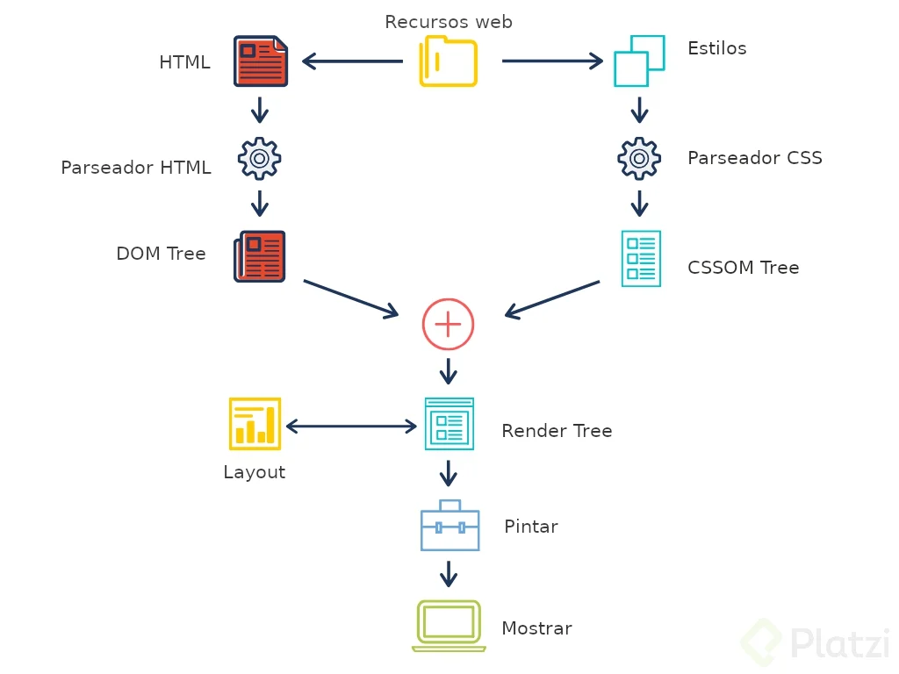
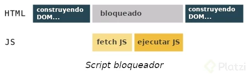

# DOM
Todas páginas web están formadas por html, css y Javascript e independienemente de la cantidad de cada uno de ellos, los navegadores siempre siguen el mismo proceso para conseguir tanto el contenido como la manera en que éste se ha de mostrar al usuario:

🔸 Generar el árbol DOM a partir del html.
🔸 Generar el CSSOM Tree a partir del css.
🔸 Generar el Render Tree con la combinación del DOM y 🔸 CSSOM
🔸 Calcular la disposición o layout de todos los nodos.
🔸 Pintar los nodos del Render Tree

## **El DOM **
Es el árbol de nodos que representa los contenidos de la página o aplicación web. Estos contenidos están determinados por el HTML y, aunque se parezca bastante al DOM, no són lo mismo.

## ¿Cómo se genera el árbol DOM?
El DOM se genera a partir del fichero con extensión .html y sigue distintos pasos para generarse:

- Convertir los bytes a carácteres.
- Pasar de carácteres a tokens.
- Generar los nodos.
- Construir el árbol DOM.

En caso de que el navegador detecte un \<script> no declarado como asíncrono en el \<head> de la página, la creación del DOM será bloqueada hasta que el Javascript sea descargado y ejecutado. Por eso es importante declarar los scripts como asíncronos.

