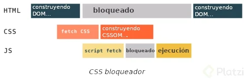

# El CSSOM
es el árbol de nodos que indicará al navegador cómo se debe pintar el DOM (el contenido que tenemos para pintar) dadas las distintas reglas que tengamos de CSS.

## ¿Cómo se genera el árbol CSSOM?
El CSSOM se genera a partir del fichero con extensión .css y sigue exactamente los mismos pasos que el DOM para generarse:

- Convertir los bytes a carácteres.
- Pasar de carácteres a tokens.
- Generar los nodos.
- Construir el árbol CSSOM.

La construcción del DOM y del CSSOM se hacen de manera asíncrona/paralela. Eso significa que el proceso de generar el CSSOM no es bloqueante para poder generar el DOM pero, si que lo es para renderizarlo.

En caso de que el navegador detecte un \<script> no declarado como asíncrono en el \<head> de la página, éste será descargado pero no ejecutado hasta que el árbol CSSOM termine de ser construido y por tanto, si el Javascript no es ejecutado, la construcción del DOM queda bloqueada.

