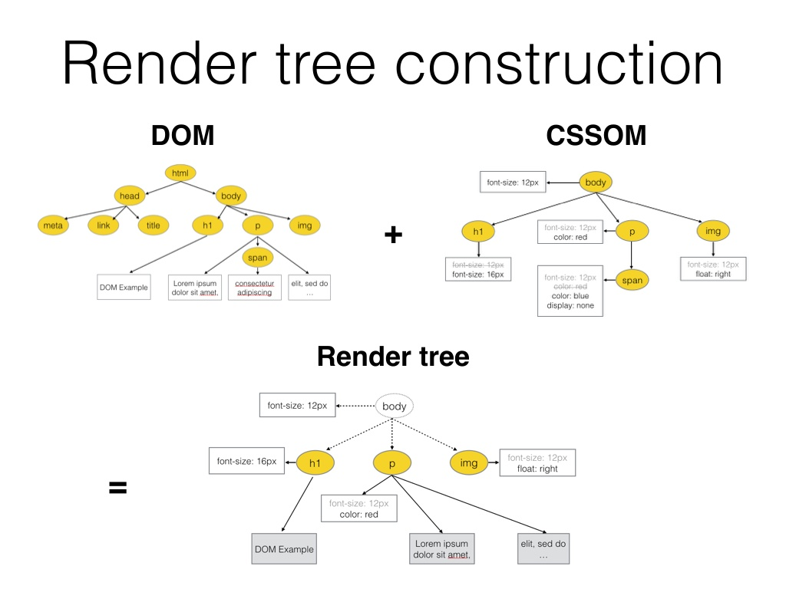

# RENDER TREE
Toda la información que el usuario ve a través de su pantalla y la manera en que ésta se presenta, viene dada por el render tree. Éste, no es más que un conjunto de nodos que tienen la información a mostrar y unos estilos atribuidos (sean los que por defectos cada buscador le atribuye a los elementos o los que nosotros hayamos querido añadirles).
|
## ¿Cómo se genera el render tree?
El render tree es la combinación de dos árboles de nodos llamados DOM y CSSOM, recordemos que:
|
El DOM es el árbol de nodos que representa los contenidos de la página o aplicación web. Estos contenidos están determinados por el HTML y, aunque se parezca bastante al DOM, no son lo mismo. Por otro lado, el CSSOM es el árbol de nodos que indicará al navegador cómo se debe pintar el DOM (el contenido que tenemos para pintar) dadas las distintas reglas que tengamos de CSS.
|
Por tanto, dependiendo de cuanta información tengamos a pintar y cuantas reglas de CSS tengamos y que tan complejas sean, tomará más o menos tiempo el generar el DOM y el CSSOM, por lo cual, más tardará en generarse el Render Tree , con lo que la carga de la página o aplicación web se verá afectada.

## Ejemplo
