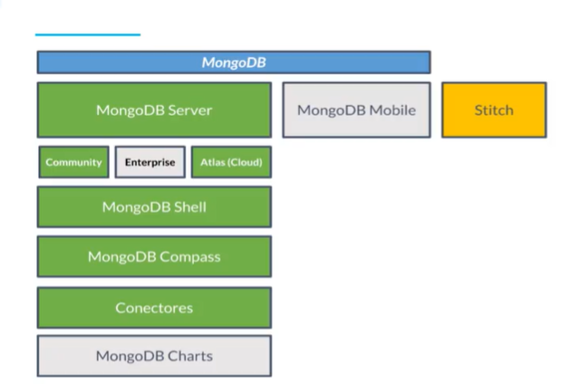

# Definición de MongoDB y su ecosistema (herramientas de uso)

MongoDB es una base de datos gratis y de código abierto No Relacional basada en documentos que nos permite guardar una gran cantidad de documentos de forma distribuida. Mongo también es el nombre de la compañía que desarrolla el código de esta base de datos.

Una de sus principales características es que nos permite guardar nuestras estructuras o documentos en formato JSON (no exactamente JSON, pero si algo muy parecido, lo veremos más adelante) para tener una gran flexibilidad a la hora de modelar situaciones de la vida real.

Por ser una base de datos distribuida podemos hablar no de uno sino de varios servidores, lo que conocemos como el Cluster de MongoDB. Gracias a esto obtenemos una gran escalabilidad de forma horizontal (escalabilidad en cantidad de servidores).

MongoDB es “Schema Less” lo que permite que nuestros documentos tengan estructuras diferentes sin afectar su funcionamiento, algo que no podemos hacer con las tablas de las bases de datos relacionales. Su lenguaje para realizar queries, índices y agregaciones es muy expresivo.

## Ecosistema MongoDB

- Mongodb Server
- Mobile
- Stich(server less)
------------------------------------------
- Community
- Enterprice (Necesitamos licencia)
- Atlas (Cloud)
------------------------------------------
Mongodb Shell -> Consola de comandos

Mongodb Compass -> Visor gráfico

Conectores -> librerias de comunicacion

Mongodb charts -> Herramientas de Bi

